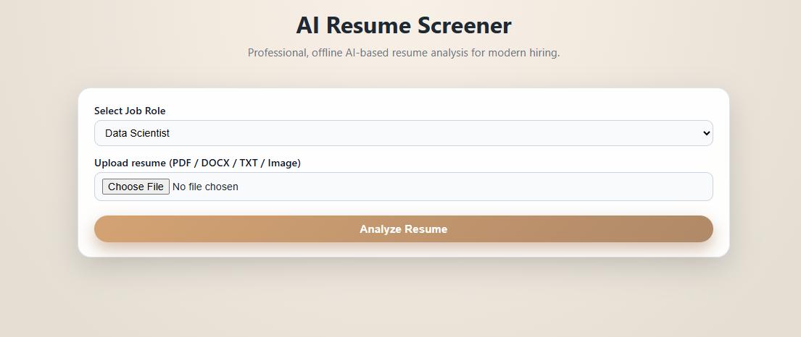
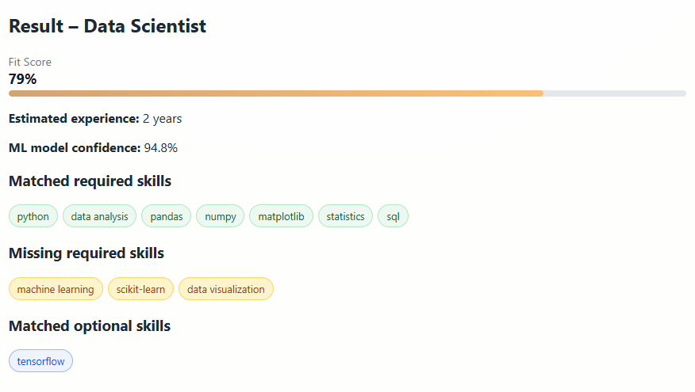

# AI Resume Screener (Offline)

An AI-based Resume Screening system built using Python and Flask.

## 🔍 Features
- Supports PDF, DOCX, TXT, and Image resumes
- OCR using Tesseract
- Machine Learning based scoring
- Multi-job role selection
- Fully offline system

## 🛠 Technologies Used
- Python
- Flask
- Scikit-learn
- Tesseract OCR
- HTML, CSS

- 📊 Outputs:
  - Fit Score (%)
  - Matched Skills
  - Missing Skills
  - Estimated Experience

- 🎨 Clean UI with Beige Professional Theme

## ▶️ How to Run

1. Create virtual environment:
   python -m venv venv

2. Activate:
   venv\Scripts\activate

3. Install dependencies:
   pip install -r requirements.txt

4. Run:
   python app.py

5. Open in browser:
   http://127.0.0.1:5000

## ⚠️ Note
- This is an **offline application**
- It must be run locally using Python and Flask
- OCR functionality works only when Tesseract is installed locally

## 📸 Screenshots

### 🏠 Home Page

### 📊 Result Page

## 📌 Project Type
Mini Project (Offline AI System)

---

## ⭐ Acknowledgment

This project was developed as part of a **college mini project** focusing on real-world AI application development.

---
